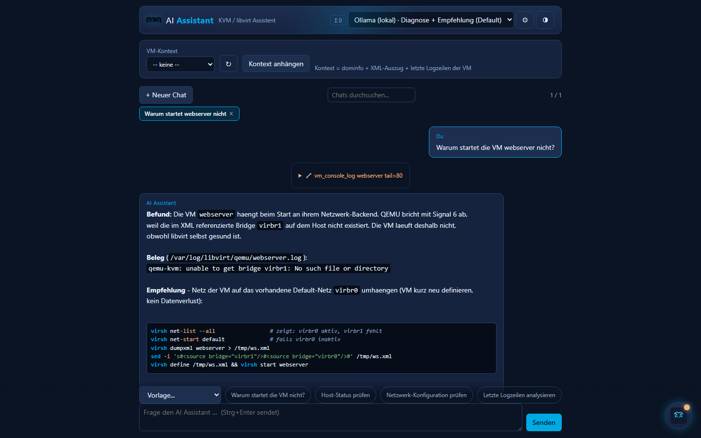
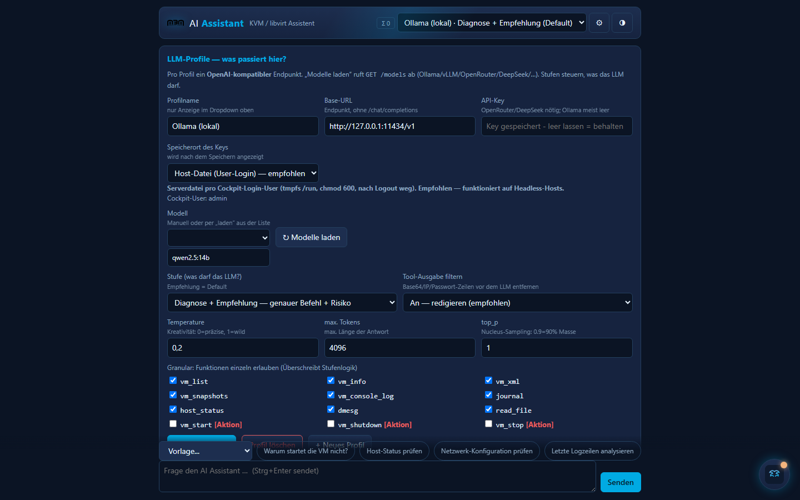

# AI Assistant ÔÇö LLM-Assistent f├╝r Red Hat Cockpit (KVM/libvirt)

<p align="center">
  <br>
  <b>Von Fans f├╝r Cockpit</b> ÔÇö Tribute an <a href="https://cockpit-project.org">cockpit-project/cockpit</a> und <a href="https://github.com/cockpit-project/cockpit-machines">cockpit-machines</a>.<br>
  MIT &amp; offen: jeder darf weiterentwickeln. Weniger Code, mehr Stabilität.
</p>

<p align="center">
  <a href="LICENSE"></a>
  <a href="#"></a>
  <a href="#"></a>
  <a href="#"></a>
  <a href="https://libvirt.org"></a>
  <a href="https://github.com/ShaoRou459/CockpitAgent"></a>
</p>

---

## Screenshot




> Screenshots sind als `docs/*.png` erwartet (eigene Installation, gerne auch als PR-Beitrag). Bis dahin zeigt der obige Icon-Block das Plugin-Wappen.

## Funktionen

| | |
|---|---|
| **In Cockpit, nicht daneben** | Eigenes Men├╝-Plugin und/oder schwebende Chat-Kachel ÔÇö direkt neben "Virtual Machines". |
| **Empfehlungs-Charakter** | Standard: Befund  Beleg (Log-/XML-Zeile)  exakter, kopierbarer Befehl inkl. Wirkung + Risiko. |
| **12 Host-Tools statt Freiflug** | `virsh`/`journalctl`/`dmesg`/`df`/`ip` & Co. als benannte Funktionen mit Regex-validierten Argumenten. Keine Shell-Pipes. |
| **Vier Stufen + Feinjustierung** | `Aus` ÔåÆ `Diagnose` ÔåÆ `Empfehlung` (Default) ÔåÆ `Aktion`. Jede Funktion einzeln abw├ñhlbar. |
| **Begleitetes Setup** | Dialog mit Erkl├ñrung, H├ñkchen und Skip ÔÇö nichts l├ñuft ohne dein OK. |
| **Multi-Chat** | Threads mit Suche, Titel-Automatik, Persistenz. |
| **Jede OpenAI-kompatible API** | Ollama, vLLM, OpenRouter, DeepSeek,  Profile komplett in der GUI. |
| **Key-Sicherheit** | tmpfs-Datei pro Login-User (`chmod 600`) ÔÇö der Key ist nie im Browser-HTML. |
| **Redaction** | IPs, Base64-Blobs, `password=`-Zeilen werden vor dem LLM-Call entfernt. |
| **DE/EN + Hell/Dunkel** | Systemsprache/-theme Erkennung, alles später umschaltbar. |

## Warum dieses Plugin?

Cockpit ist eine brillante Server-GUI ÔÇö aber wenn eine VM nicht startet, sitzt man trotzdem vor Logs.
**AI Assistant** sitzt *in* Cockpit, darf dem Host nur ├╝ber eine eng definierte Allowlist ÔÇ×hineinschauenÔÇ£
und antwortet im **Empfehlungs-Charakter**: Befund  Beleg  kopierbarer Befehl.
Es ist bewusst *kein* Autopilot. Du bestimmst per **Stufe**, was das LLM tun darf.

Dank `cockpit.http` (Bridge-Proxy) und `cockpit.spawn` (argv-Allowlist + polkit) laufen
alle Zugriffe ├╝ber die Cockpit-Schicht ÔÇö ohne Build-Step, ohne Daemon, ohne Shell-Pipes.

## Einrichten ÔÇö begleitet, optional, ├╝berspringbar

Das Plugin startet beim ersten Öffnen einen **geführten Setup-Dialog**: jeder Schritt hat eine
Erklärung, ein Häkchen (mag ich / mag ich nicht) und einen **Skip**-Button. Nichts wird
ungefragt installiert. Der Dialog l├ñsst sich sp├ñter ├╝ber ÔÇ×ÔÜÖ Setup startenÔÇ£ erneut ├Âffnen.

Alternativ manuell (1 Befehl):

```bash
git clone https://github.com/mcathereal/cockpit-ai-assistant
sudo cp -r cockpit-ai-assistant/ai-assistant /usr/share/cockpit/ai-assistant
```

Browser neu laden ÔåÆ Men├╝punkt **AI Assistant**. Kein Cockpit-Neustart n├Âtig.

## Position & Aussehen (später änderbar)

Knopf **ÔÜá (Darstellung)** oben rechts ÔÇö dort w├ñhlst du:

| Option | Wirkung |
|---|---|
| Seite &amp; Kachel (empfohlen) | Fester Men├╝punkt + schwebendes Chat-Icon |
| Nur eigene Seite im Men├╝ | Wie cockpit-machines ÔÇö nur Navigationspunkt |
| Nur schwebende Kachel | Chat-Icon am Rand, kein Men├╝punkt sichtbar |

Kachel-Position: unten rechts / unten links / oben rechts / oben links.
Farbtheme: System/Cockpit folgen, Dunkel (Navy) oder Hell.
Sprache: System folgen, Deutsch oder Englisch.

Alles lokal in `localStorage` gespeichert ÔÇö pro Browser, sofort wirksam, ohne Cockpit-Neustart.

## Sicherheitsmodell (Kurzfassung)

| Ebene | Umsetzung |
|---|---|
| **Keys** | **Niemals** im Browser, nie im HTML/JS. Primär: Serverdatei pro Login-User auf tmpfs (`/run/ai-assistant/<user>.json`, `chmod 600`, nach Logout weg). Fallback: `localStorage` des Browsers + Warnhinweis. |
| **LLM-Zugriff** | Stufe `off` / `diagnose` / `advisory` (Default) / `act`. Granular pro Tool abwählbar. Write-Tools (`vm_*`) immer GUI-bestätigt, `superuser:"try"` nur auf deklarierten Pfaden. |
| **Datenweg** | Tool-Ausgaben werden vor R├╝ckgabe ans LLM **redacted** (Base64-Sequenzen, IPs, `password=`-Zeilen) und auf `tail`-Gr├Â├ƒen gecappt. |
| **Stabilit├ñt** | spawn-timeout 30 s, LLM-Timeout 120 s, Chat-FIFO (24 Meldungen), jede Fehlerstelle ÔåÆ saubere Fehlerbox statt wei├ƒer Bildschirm. |
| **Kein Freiflug** | Das LLM sieht **niemals** eine Shell. Nur benannte Funktionen mit validierten Argumenten (Regex), feste Schalter, Präfix-Leseliste. |

## LLM-Profile (in der GUI, kein Editieren von Dateien)

Zahnrad ÔåÆ Profil anlegen ÔåÆ Base-URL + Modell + optional Key ÔåÆ **Stufe** w├ñhlen ÔåÆ Speichern.

| Backend | Base-URL | Modell (Tool-Calling) |
|---|---|---|
| Ollama (lokal, empfohlen) | `http://127.0.0.1:11434/v1` | `qwen2.5:14b`, `llama3.1` |
| vLLM | `http://host:8000/v1` | serving-Modell |
| OpenRouter | `https://openrouter.ai/api/v1` | frei wählbar |
| DeepSeek | `https://api.deepseek.com/v1` | `deepseek-chat` |
| OpenAI-kompatibel | eigene URL | ÔÇö |

**Stufen:**
- `Aus` ÔÇö Chat sendet nichts ans LLM.
- `Nur Diagnose` ÔÇö read-only Werkzeuge, keine Handlungsempfehlung als Befehl.
- `Empfehlung` (Default) ÔÇö wie Diagnose, aber mit exaktem L├Âsungsbefehl + Risiko-Absch├ñtzung.
- `Aktion` ÔÇö zus├ñtzlich `vm_start` / `vm_shutdown` / `vm_stop`, **jeder** Aufruf mit Best├ñtigungsdialog.

Feiner: im Profil jede Funktion einzeln an-/ausschalten (Checkbox-Liste).

## Changelog

Siehe [CHANGELOG.md](CHANGELOG.md) ÔÇö SemVer, Keep-a-Changelog-Format.

## Mitmachen ÔÇö so wie Cockpit es uns vormacht

Wir sind Cockpit-**Fans** und verstehen dieses Plugin als Tribut an die
[cockpit-project](https://github.com/cockpit-project/cockpit)-Community (und als Anstoß an
[cockpit-machines](https://github.com/cockpit-project/cockpit-machines), mal ├╝ber einen
LLM-Kontext-Knopf nachzudenken). Wenn du eine Idee hast:

1. Fork  Branch `feature/...`
2. `node --check ai-assistant/js/agent.js` (kein Build sonst)
3. PR ÔÇö wir Reviewen mit dem Ziel ÔÇ×weniger Code, mehr Stabilit├ñtÔÇ£

**Guidelines:** keine Build-Tools, keine npm-Dependencies, kein externer CDN-Laden,
alles `superuser`-relevante muss in `manifest.json` deklariert sein.

## Dank

An die **cockpit-project**-Leute: Dass eine Server-GUI so sauber erweiterbar ist ÔÇö `spawn`,
`http`, `manifest.json`, keine Build-Pflicht ÔÇö ist der eigentliche Grund, warum dieses Plugin
├╝berhaupt in wenigen Tagen entstehen konnte. Ihr habt die Br├╝cken gebaut; wir haben nur
einen Chat daneben gesetzt.

Ebenso danke an die **cockpit-machines**-Maintainer: deren Code-Lesart (`libvirt-dbus`,
Tool-Namensgebung, Bestätigungsdialoge) war stiller Leitfaden für jedes Tool hier.

Und danke an [CockpitAgent](https://github.com/ShaoRou459/CockpitAgent): der fr├╝he Beweis,
dass AI in Cockpit kein Fremdk├Ârper sein muss.

## Inspiration & Tribute

- [cockpit-project/cockpit](https://github.com/cockpit-project/cockpit) ÔÇö API/Design-Vorbild
- [cockpit-machines](https://github.com/cockpit-project/cockpit-machines) ÔÇö die VM-GUI, die wir lieben
- [cockpit-project.org/guide](https://cockpit-project.org/guide/latest/) ÔÇö Bridge/`spawn`/`http` dokumentiert
- [CockpitAgent](https://github.com/ShaoRou459/CockpitAgent) ÔÇö fr├╝her Proof, dass AI-in-Cockpit geht

## License

[MIT](LICENSE) ┬® 2026 Marcel Weise. Teilen, verbessen, forken erw├╝nscht.
