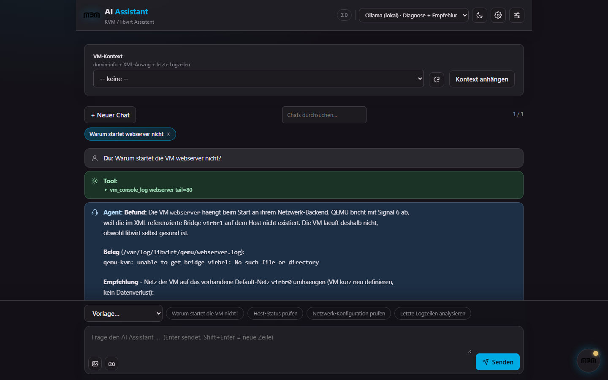
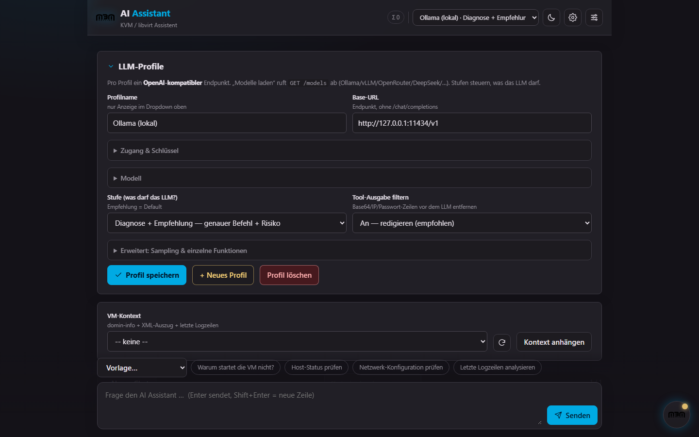
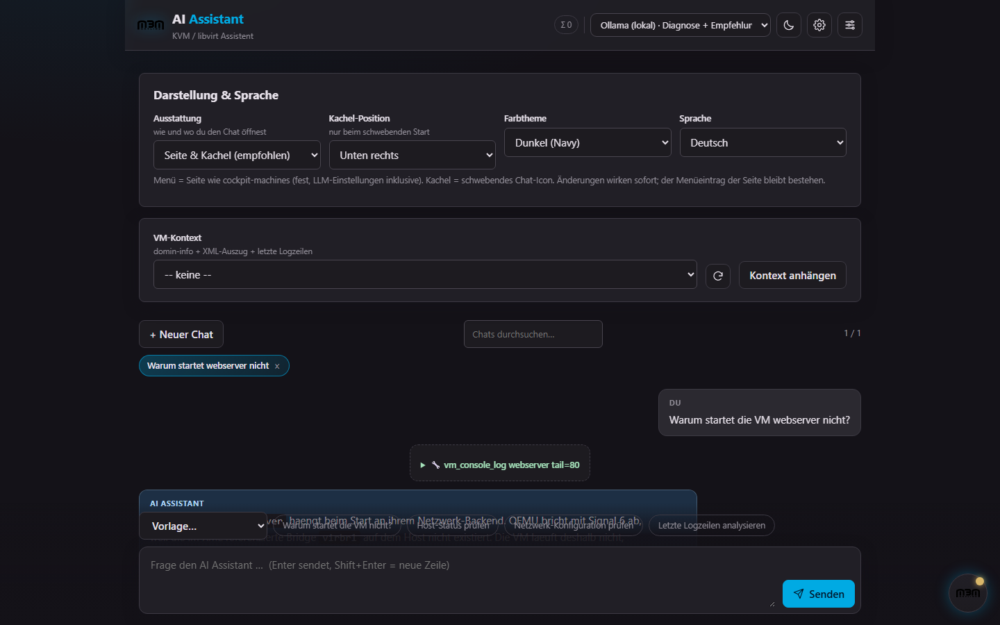
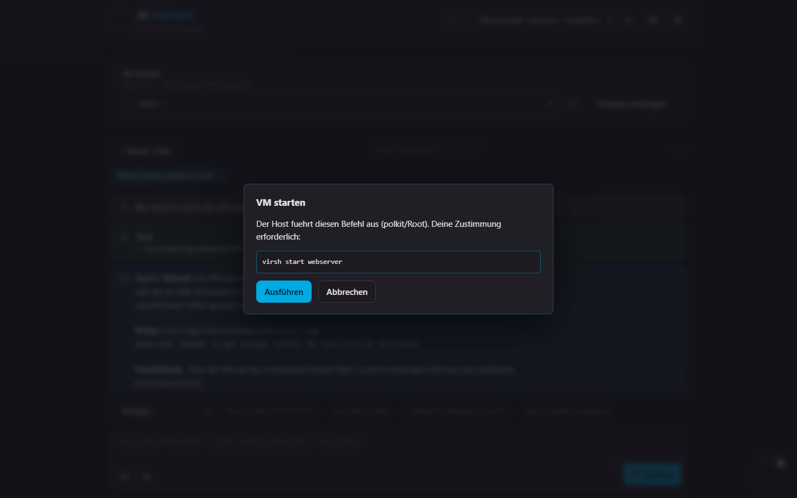
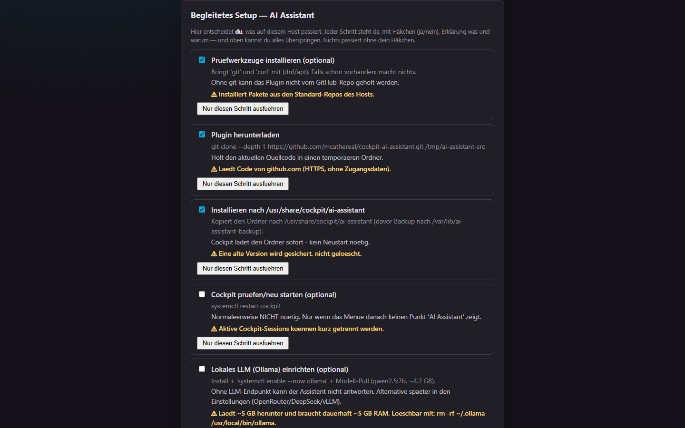

# AI Assistant — LLM assistant for Red Hat Cockpit (KVM/libvirt)

**English** | [Deutsch](README.de.md)

<p align="center">
  <br>
  <b>By fans, for Cockpit</b> — a tribute to <a href="https://cockpit-project.org">cockpit-project/cockpit</a> and <a href="https://github.com/cockpit-project/cockpit-machines">cockpit-machines</a>.<br>
  MIT &amp; open: anyone may improve it. Less code, more stability.
</p>

<p align="center">
  <a href="LICENSE"></a>
  <a href="#"></a>
  <a href="#"></a>
  <a href="#"></a>
  <a href="https://libvirt.org"></a>
  <a href="https://github.com/ShaoRou459/CockpitAgent"></a>
</p>

---

## Screenshots

| Chat view (finding → evidence → command) | LLM profiles & levels |
|---|---|
|  |  |
| **Appearance & language** | **Action with confirmation** |
|  |  |

Setup dialog (on first open, skippable):



> The pictures come from the real UI. Regenerate them without a Cockpit host:
> `powershell -NoProfile -ExecutionPolicy Bypass -File tools/make-screenshots.ps1`
> (uses the installed Chromium browser plus `tools/preview/cockpit-mock.js` as a bridge stand-in).

## Features

| | |
|---|---|
| **Inside Cockpit, not beside it** | Own menu plugin and/or floating chat tile — right next to "Virtual Machines". |
| **Advisory character** | Default: finding → evidence (log/XML line) → exact, copyable command including effect and risk. |
| **12 host tools instead of free flight** | `virsh`/`journalctl`/`dmesg`/`df`/`ip` & co. as named functions with regex-validated arguments. No shell pipes. |
| **Four levels + fine tuning** | `off` → `diagnose` → `advisory` (default) → `act`. Every function can be disabled individually. |
| **Guided setup** | Dialog with explanation, checkbox and skip — nothing runs without your OK. |
| **Multi-chat** | Threads with search, automatic titles, persistence. |
| **Any OpenAI-compatible API** | Ollama, vLLM, OpenRouter, DeepSeek, … profiles entirely in the GUI. |
| **Key safety** | tmpfs file per login user (`chmod 600`) — the key never lives in browser HTML. |
| **Redaction** | IPs, Base64 blobs and `password=` lines are stripped before the LLM call. |
| **Turn view (Call-AI style)** | Role icons + labels (`You:`, `Agent:`, `Tool:`, `Note:`), tool output folded — a calmer transcript. |
| **Floating chat window** | The bottom-right button opens a small popup that stays open while navigating Cockpit and shares the same chats. |
| **Images / VL models** | Attach images (click, paste or drag & drop) or capture the screen — sent natively as `image_url` to a vision-capable model (same pattern as the Qwen-MM-Plugins `core`). |
| **MCP in both directions** | Register foreign MCP servers in the plugin (their tools are used too) — and expose the 12 host tools via `tools/mcp-host-server.py` as your own MCP server for Claude, opencode & co. |
| **DE/EN + light/dark** | System language/theme detection, everything switchable later. |

## Why this plugin?

Cockpit is a brilliant server GUI — but when a VM won't start you still stare at logs.
**AI Assistant** sits *inside* Cockpit, may only "look into" the host through a narrow allowlist,
and answers in an **advisory** style: finding → evidence → copyable command.
It is deliberately *not* an autopilot. You decide per **level** what the LLM may do.

Thanks to `cockpit.http` (bridge proxy) and `cockpit.spawn` (argv allowlist + polkit), every access
goes through the Cockpit layer — no build step, no daemon, no shell pipes.

## Setup — guided, optional, skippable

On first open the plugin starts a **guided setup dialog**: every step has an explanation, a checkbox
(want / don't want) and a **skip** button. Nothing is installed unasked. The dialog can be reopened
later via "⚙ Start setup".

Or manually (one command):

```bash
git clone https://github.com/mcathereal/cockpit-ai-assistant
sudo cp -r cockpit-ai-assistant /usr/share/cockpit/ai-assistant
```

Reload the browser → menu entry **AI Assistant**. No Cockpit restart needed.

## Position & appearance (changeable later)

Button **(Appearance)** top right — there you choose:

| Option | Effect |
|---|---|
| Page &amp; tile (recommended) | Fixed menu entry + floating chat icon |
| Own page in the menu only | Like cockpit-machines — navigation point only |
| Floating tile only | Chat icon at the edge, no menu entry visible |

Tile position: bottom right / bottom left / top right / top left.
Colour theme: follow system/Cockpit, dark (navy) or light.
Language: follow system, German or English.

Everything stored locally in `localStorage` — per browser, effective immediately, no Cockpit restart.

## Security model (short version)

| Layer | Implementation |
|---|---|
| **Keys** | **Never** in the browser, never in HTML/JS. Primary: persistent server file per login user (`/var/lib/cockpit/ai-assistant-keys/<user>.json`, directory `0700`, file `0600`, survives reboot). Fallback: browser `localStorage` plus a warning. |
| **LLM access** | Levels `off` / `diagnose` / `advisory` (default) / `act`. Granular per tool. Write tools (`vm_*`) always GUI-confirmed, `superuser:"try"` only on declared paths. |
| **Data path** | Tool output is **redacted** before returning to the LLM (Base64 sequences, IPs, `password=` lines) and capped to `tail` sizes. |
| **Stability** | spawn timeout 30 s, LLM timeout 120 s, chat FIFO (24 messages), every error site → clean error box instead of a white screen. |
| **No free flight** | The LLM **never** sees a shell. Only named functions with validated arguments (regex), fixed switches, prefix read-list. |

## LLM profiles (in the GUI, no file editing)

Gear → create profile → base URL + model + optional key → choose **level** → save.

| Backend | Base URL | Model (tool calling) |
|---|---|---|
| Ollama (local, recommended) | `http://127.0.0.1:11434/v1` | `qwen2.5:14b`, `llama3.1` |
| vLLM | `http://host:8000/v1` | served model |
| OpenRouter | `https://openrouter.ai/api/v1` | free choice |
| DeepSeek | `https://api.deepseek.com/v1` | `deepseek-chat` |
| OpenAI-compatible | own URL | — |

**Levels:**
- `off` — the chat sends nothing to the LLM.
- `diagnose only` — read-only tools, no action recommendation as a command.
- `advisory` (default) — like diagnose, plus an exact fix command and a risk estimate.
- `act` — additionally `vm_start` / `vm_shutdown` / `vm_stop`, **every** call with a confirmation dialog.

Finer: switch each function on/off individually in the profile (checkbox list).

## MCP (tools in both directions)

**Direction 1 — use foreign tools:** In *LLM profiles → MCP servers (tools from outside)* enter a
Streamable-HTTP endpoint (plus optional bearer token, stored only in the browser) and click
**Load tools**. The discovered tools are offered to the model in addition to the 12 host tools.

**Direction 2 — offer the host tools to others:** `tools/mcp-host-server.py` (Python standard library only)
publishes the same tools as an MCP server:

```bash
sudo install -m 0755 tools/mcp-host-server.py /usr/local/lib/ai-assistant-mcp/
sudo mkdir -p /etc/ai-assistant-mcp
head -c 32 /dev/urandom | od -An -tx1 | tr -d ' \n' | sudo tee /etc/ai-assistant-mcp/token >/dev/null
sudo chmod 600 /etc/ai-assistant-mcp/token
sudo python3 /usr/local/lib/ai-assistant-mcp/mcp-host-server.py \
  --bind 0.0.0.0 --port 8765 --token-file /etc/ai-assistant-mcp/token
```

Default is **read-only** (write tools only with `AI_ASSISTANT_MCP_ALLOW_WRITE=1`), and without a valid
token the server answers `401`.

## Changelog

See [CHANGELOG.md](CHANGELOG.md) — SemVer, Keep-a-Changelog format.

## Contributing — the way Cockpit shows us

We are Cockpit **fans** and understand this plugin as a tribute to the
[cockpit-project](https://github.com/cockpit-project/cockpit) community (and as a nudge to
[cockpit-machines](https://github.com/cockpit-project/cockpit-machines) to think about an
LLM context button). If you have an idea:

1. Fork → branch `feature/...`
2. `node --check ai-assistant/js/agent.js` (no other build)
3. PR — we review with the goal "less code, more stability"

**Guidelines:** no build tools, no npm dependencies, no external CDN loads,
everything `superuser`-relevant must be declared in `manifest.json`.

## Thanks

To the **cockpit-project** people: that a server GUI is this cleanly extensible — `spawn`,
`http`, `manifest.json`, no build requirement — is the real reason this plugin could exist in a
few days. You built the bridges; we just put a chat next to them.

Also thanks to the **cockpit-machines** maintainers: their way of reading code (`libvirt-dbus`,
tool naming, confirmation dialogs) was the silent guide for every tool here.

And thanks to [CockpitAgent](https://github.com/ShaoRou459/CockpitAgent): the early proof that
AI in Cockpit is not a foreign body.

## Inspiration & tribute

- [cockpit-project/cockpit](https://github.com/cockpit-project/cockpit) — API/design role model
- [cockpit-machines](https://github.com/cockpit-project/cockpit-machines) — the VM GUI we love
- [cockpit-project.org/guide](https://cockpit-project.org/guide/latest/) — documents bridge/`spawn`/`http`
- [CockpitAgent](https://github.com/ShaoRou459/CockpitAgent) — early proof that AI-in-Cockpit works

## License

[MIT](LICENSE) © 2026 Marcel Weise. Sharing, improving and forking welcome.